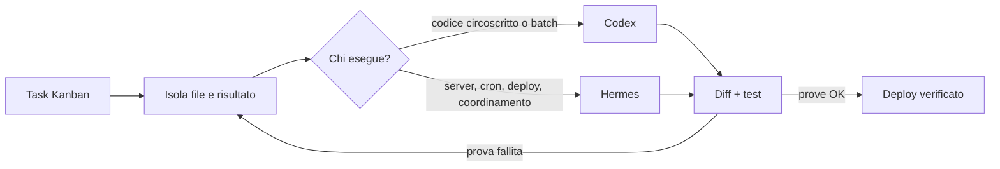

# Code Wiki

Questa è la guida operativa di Mauro per affidare il coding a Hermes e Codex senza perdere controllo, convenzioni STH o tempo in verifiche vaghe.

> [!TIP] Follow me: scegli un task reale, apri la pagina adatta e copia il prompt. Non leggere tutto prima di iniziare.

## La regola che guida tutto

**L’AI scrive. Tu definisci il risultato e accetti solo prove.** Ho provato a considerare “fatto” ciò che il modello dichiarava concluso: il bug restava live, oppure erano cambiati file non richiesti. Da qui la regola: nessun “done” senza comando, output e test funzionale.



## Scegli la porta giusta

| Se devi… | Usa | Parti da |
|---|---|---|
| correggere una pagina PHP/JS | Codex | [Tutorial fix bug](tutorial-fix-bug.md) |
| coordinare analisi, backup e deploy | Hermes | [Setup Hermes](setup-hermes.md) |
| modificare molti file simili | Codex, batch piccoli | [Tutorial batch](tutorial-batch.md) |
| adottare un repo sconosciuto | Hermes per audit, Codex per codice | [Import](import.md) |
| fissare le convenzioni STH | una skill locale | [Creare skill](creating-skills.md) |
| decidere configurazione e controlli | entrambi | [Best Practices 2026](best-practices.md) |

## Percorso consigliato

1. Leggi [Il Metodo](metodo.md) e usa la formula del prompt.
2. Incolla [Il mio stile](stile.md) in `AGENTS.md` del repo STH.
3. Configura [Hermes](setup-hermes.md) e [Codex](setup-codex.md) col minimo indispensabile.
4. Esegui un tutorial su un branch o una copia locale.
5. Porta ogni lavoro nel [Kanban](kanban.md).
6. Fai [deploy](deploy.md) solo dopo le prove.

> [!DANGER] Non inserire password, token FTP o chiavi API nei prompt, nei file versionati o in `configure.php`. Indica solo il nome della variabile segreta.

## Avvio locale

```bash
# WHY: fetch() non può leggere i Markdown da file:// in modo affidabile su iPhone/Mac.
cd /home/clawy/dev/code-wiki
python3 -m http.server 8000
```

Apri `http://localhost:8000`. La UI non usa CDN e funziona offline sulla rete locale dopo che il server è avviato.
