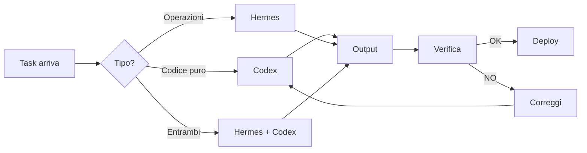

# Il Metodo

> Il tuo sistema operativo per lavorare con Hermes + Codex.

---

## Filosofia

**L'AI scrive codice, tu controlli.**

L'AI non sostituisce il tuo giudizio. Lo amplifica. Tu decidi cosa fare, l'AI lo esegue, tu verifichi. Se qualcosa non va → correggi tu, aggiungi la regola, ripeti.

---

## La Formula Universale

Per ogni task, usa questo prompt:

```
FILE: [path esatto]
TASK: [cosa fare]
INPUT: [dati, esempio, contesto]
OUTPUT: [cosa mi aspetto alla fine]
VINCOLI: [cosa NON toccare]
VERIFICA: [comando per testare]
```

---

## Flusso di Lavoro



---

## Regole d'Oro

<div class="callout callout-danger">

1. **Non fidarti MAI del "fato"** → verifica SEMPRE
2. **Un task alla volta** → batch max 5-10 file
3. **Backup prima di batch grandi** → `cp -r dir dir.bak`
4. **Bump versione a ogni deploy** → evita cache
5. **Non toccare `*_old/`** → sono backup morti
6. **Non modernizzare SQL** → `mysql_*` OK
7. **Non tradurre dominio** → rapportini, interventi, laboratorio

</div>

---

## Checklist Post-AI

Prima di considerare completato un task:

- [ ] `php -l` passa
- [ ] `grep` pattern sbagliati = 0
- [ ] `grep` pattern corretti > 0
- [ ] `git diff --stat` mostra solo file attesi
- [ ] Test funzionale (browser/curl) OK
- [ ] Vincoli rispettati (niente toccato dove non doveva)
- [ ] Domain naming preservato
- [ ] Stile rispettato

---

## Lingua

| Strumento | Lingua | Motivazione |
|-----------|--------|-------------|
| Hermes | 🇮🇹 Italiano | Sei più veloce, esprimi meglio i contesti |
| Codex | 🇬🇧 Inglese | Training data più ampio, coding meglio in EN |

---

## Prossimo Passo

Vai a [Setup Strumenti](setup.md) per configurare Hermes e Codex.
